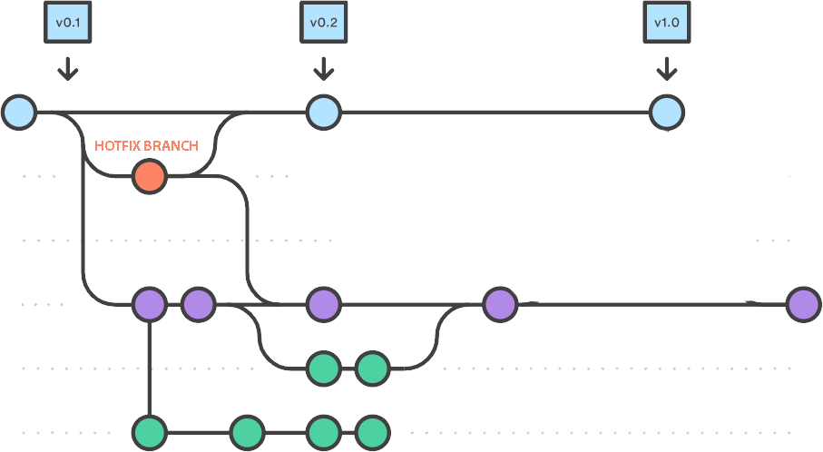
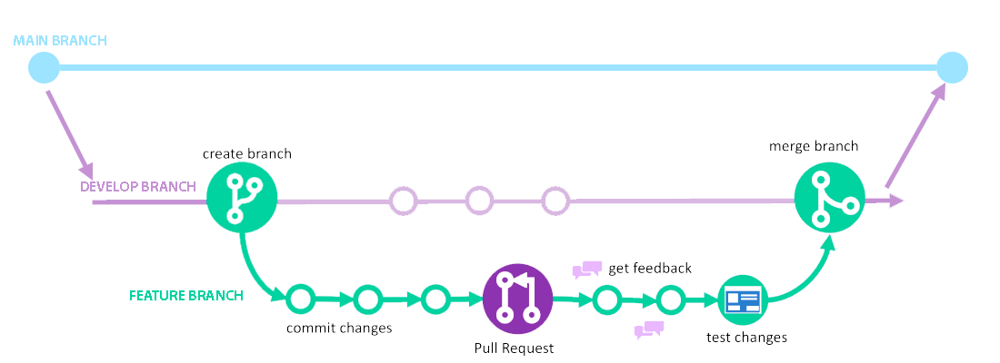

## Ramas Principales

Para registrar el historial del proyecto vamos a usar la ramas principales **_main_** y **_develop_**, de las cuales solo existe una de cada tipo y que no podrán recibir código de forma directa a través de commit, siempre tiene que recibir código a través de las ramas de apoyo:

- **main**: Es la rama principal y donde se encuentra la versión oficial y última definitiva del proyecto. Se usara una tag para identificar el número de versión.
- **develop**: Contiene el código de desarrollo de la siguiente versión planificada del proyecto. En ella se incluirán cada una de las nuevas características que se desarrollen y será la que se le hagan los test y cuando esté todo verificado el deploy. Una vez el deploy funcione se integrarán los cambios a la rama _main_

> En la rama Main no se hace push ni pull request, todo se hará en develop hasta que esté todo verificado y se decida actualizar los cambios de la rama develop a main

## Ramas de apoyo

Las ramas de apoyo las usaremos para que los desarrolladores podamos trabajar en paralelo sin afectar a las ramas principales. Será una vez finalizado el desarrollo cuando se incorpore la esta rama de apoyo a la rama _develop_.

Estas ramas tienen un principio y un fin, ya que cuando se mergea con la rama _develop_ desaparecen.

Las ramas de apoyo son:

- **feature**: Estas ramas tienen que surgir de la rama _develop_. Cada una de estas ramas almacenan código de desarrollo con nuevas características y requisitos. Una vez terminado su desarrollo, se incorporarán nuevamente a la rama _develop_, que contendrá la última versión de código en desarrollo.

- **hotfix**: la utilizaremos para arreglar código y bugs, por haberse detectado un defecto crítico o que el cliente haya pedido algún cambio. Esta rama se usará de manera excepcional puesto que el deploy se hará de manera contínua y siempre testeado. Esta rama siempre saldrá de main y una vez hechos los cambios se devuelve a _develop_, se hace el deploy y se agrega a _main_

## Pasos a seguir

1. Creación de Rama Main
2. Creacion de Rama Develop
3. Si hay una nueva característica de desarrollo se crea una rama **feature**
4. Se desarrolla en la rama feature y se hacen los commits
5. Una vez finalizados los cambios en **feature** se hace una **Pull Request**
6. A través de Github Actions, revisión de test y equipo se mergea a la rama **develop**
7. Se borra la rama **feature** creada para este propósito
8. Se hace deploy de la rama **develop**
9. Si hubiese algo que solucionar se crea una rama **hotfix**
10. Una vez funciona el deploy se mergea **develop** con **main**

